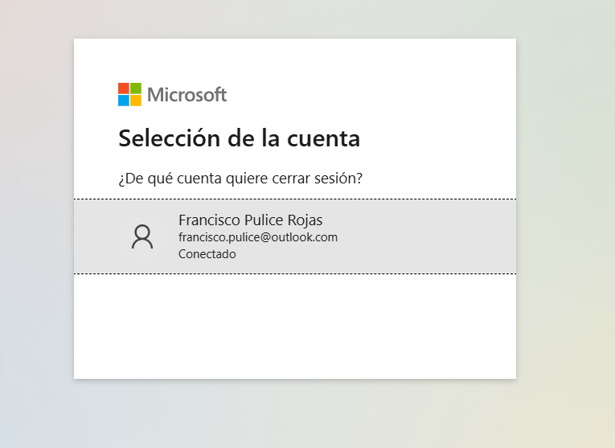
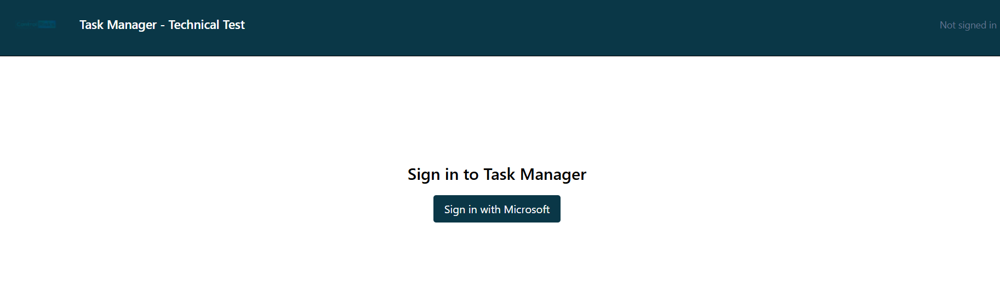
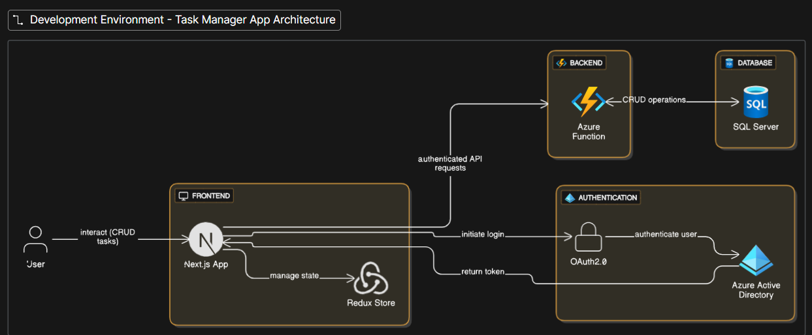

# Task Manager -- Technical Test

## 📸 Screenshots

Screenshots of the running project are available in the `/imgs/`
folder.\
Example usage (replace with actual names):

``` markdown


```

------------------------------------------------------------------------

## 🚀 How to Run Locally

### 1. Client (Frontend)

Located in `/client/` -- built with **Next.js v15**, **Redux Toolkit**,
and **TailwindCSS**.

``` bash
cd client
npm install
npm run dev
```

### 2. API (Backend -- Azure Functions)

Located in `/api/` -- built with **.NET 9.0** and **Azure Functions
v4**.

Steps:

``` bash
cd api
dotnet build   # optional: ensures dependencies are restored
func start     # starts Azure Functions locally
```

#### ⚙️ Configuration

Edit `local.settings.json` if you want to use your own credentials:

``` json
{
  "Values": {
    "SqlConnection": "<YOUR_SQL_CONNECTION>",
    "OIDC:Authorization": "<YOUR_OIDC_AUTHORIZATION_URL>",
    "OIDC:Client": "<YOUR_CLIENT_ID>"
  }
}
```

The backend uses an **ORM** that automatically creates the tables when
you start the project (`func start`).

### 3. Database (SQL Server)

Located in `/sql/`.

-   Create a new SQL Server database.
-   Apply the schema provided (diagram available in `/sql/`).
-   Alternatively, rely on ORM auto-migration when running the API.

------------------------------------------------------------------------

## 🔑 Authentication Setup (Microsoft Identity)

This project integrates authentication using **Microsoft Identity
Platform (OAuth2/OpenID Connect)**.\
- The API validates JWT tokens issued by Microsoft Identity.\
- Update your `local.settings.json` with your Azure AD tenant details if
not using the provided credentials.

------------------------------------------------------------------------

## 📖 API Documentation

Available in `/docs/`: - **Swagger**:
[`Swagger_TaskManagerAPI-1.0.0-resolved.yml`](./docs/Swagger_TaskManagerAPI-1.0.0-resolved.yml)\
- **Postman Collection**: also included in `/docs/` for easy API
testing.

------------------------------------------------------------------------

## 🏗️ Architecture Decisions & Patterns Used

-   **Repository Pattern** -- separates data access from business
    logic.\
-   **Factory Pattern** -- encapsulates object creation for
    maintainability.\
-   **Dependency Injection (DI)** -- improves testability and loose
    coupling.

**Stack Overview:** - **Frontend**: Next.js 15 + Redux Toolkit +
TailwindCSS\
- **Backend**: Azure Functions v4 (.NET 9.0)\
- **Database**: SQL Server with ORM auto-migrations\
- **Auth**: Microsoft Identity Platform (OIDC, JWT)\
- **Tests**: xUnit + Moq



------------------------------------------------------------------------

## 🔮 Improvements if Given More Time

If more time were available, I would: 1. **Implement SignalR** for
real-time task status updates.\
2. **Add role-based access control** (admin/user) to manage task states
and visualize long-term trends.\
3. **Containerize with Docker** (API, client, DB) for better CI/CD and
Gitflow practices.

------------------------------------------------------------------------


